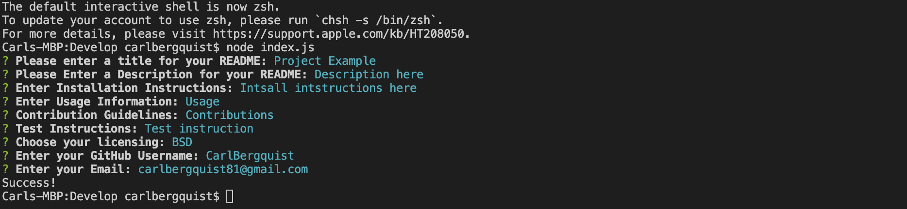

# README-Gen

## Contributors

Carl Bergquist

## Description

In this challange we were required to make a node.js app that would generate a readme file for us given a series of prompts.
It rquiered us to use the inquirer npm package along with the fs to write files to our system. 

## Usage

Download the files in the develop folder and open up Develop in VSCode. Then open up 'index.js' in the terminal, next type in node index.js and then follow the prompts. Once complete it will create a README.md file in which all the content that you entered will be displayed under the correct header.

## Screenshot

## Video

Link to video: https://drive.google.com/file/d/1a0oGqphlSSyfTNsmsxUViD872anrCJRi/view